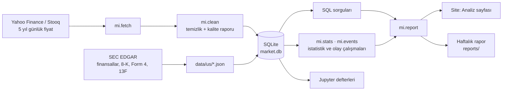
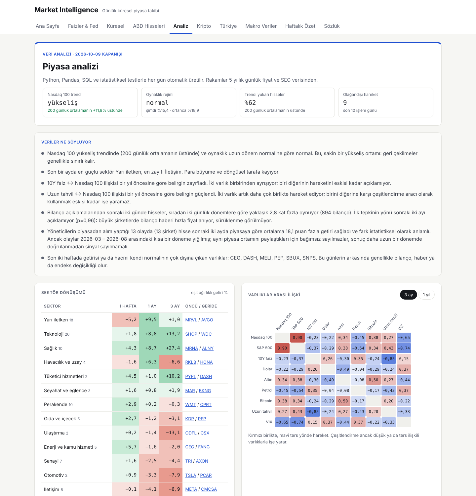
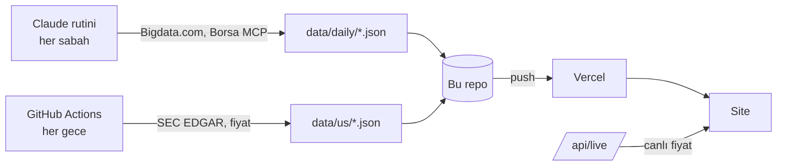

<div align="center">

# Market Intelligence

**Piyasa verisi için uçtan uca veri analizi projesi: veri toplama, temizleme, SQL, istatistik, görselleştirme ve otomatik raporlama.**

ABD · Avrupa ve Asya · Faiz ve Fed · Makro veriler · Kripto · Türkiye · ABD hisseleri


</div>

---

## Veri analizi

Bu bölüm projenin veri analizi tarafını özetler: hangi soruları sorduğu, veriyi nasıl işlediği ve ne bulduğu.

### Sorular
1. Nasdaq 100 hisselerinin getirileri nasıl dağılıyor; riskler normal dağılım varsayımıyla doğru ölçülebilir mi?
2. Varlıklar arasındaki ilişkiler (Bitcoin–Nasdaq, altın–dolar, faiz–teknoloji) sabit mi, rejime göre mi değişiyor?
3. Bilanço açıklamalarına piyasa nasıl tepki veriyor; ilk tepki sonraki haftalarda sürüyor mu?
4. Yöneticiler kendi hisselerini aldıktan sonra hisse piyasadan iyi gidiyor mu?

### Veri hattı


### Beceri haritası

| Beceri | Nerede |
|---|---|
| Veri toplama | [`mi/fetch.py`](analytics/mi/fetch.py): yedekli kaynak, toplu indirme · [`scripts/us/build.mjs`](scripts/us/build.mjs): SEC EDGAR |
| Temizleme ve dönüştürme (Pandas) | [`mi/clean.py`](analytics/mi/clean.py): tekrarlar, hatalı fiyat tespiti, takvim hizalama, kalite raporu |
| SQL | [`analytics/sql/`](analytics/sql): CTE, `ROW_NUMBER`, `RANK`, `PERCENT_RANK`, `LAG`, kayan ortalama, pivot · [`mi/db.py`](analytics/mi/db.py): şema |
| Keşifsel analiz | [`01_veri_ve_kesif.ipynb`](analytics/notebooks/01_veri_ve_kesif.ipynb): dağılımlar, kalın kuyruk, aylık getiri ısı haritası, sektör risk/getiri |
| İstatistiksel analiz | [`mi/stats.py`](analytics/mi/stats.py), [`02_risk_ve_iliskiler.ipynb`](analytics/notebooks/02_risk_ve_iliskiler.ipynb): oynaklık, beta, düşüş, kayan korelasyon, Fisher z testi, otokorelasyon |
| Hipotez testi | [`mi/events.py`](analytics/mi/events.py), [`03_olay_calismalari.ipynb`](analytics/notebooks/03_olay_calismalari.ipynb): piyasa modeliyle olay çalışması, t-testi, Welch, Spearman |
| Görselleştirme | [`mi/charts.py`](analytics/mi/charts.py), sitedeki [Analiz sayfası](analiz.html) |
| Otomatik raporlama | [`analytics.yml`](.github/workflows/analytics.yml): her gün analiz, her cumartesi [haftalık rapor](reports) ve defterler |
| Test | [`analytics/tests/`](analytics/tests): temizlik kuralları, beta, korelasyon, anormal getiri hesabı |

### Bulgular
Güncel sonuçlar her hafta [haftalık raporda](reports) ve sitenin Analiz sayfasında otomatik yenilenir.

İlk çalıştırma (5 yıllık veri, 2026-10-09 kapanışı) sonuçları:

| Soru | Bulgu |
|---|---|
| Getiriler normal dağılıyor mu? | Hayır. Nasdaq 100 günlük getirilerinde kalın kuyruk var; Jarque-Bera testi normalliği reddediyor. Oynaklıkla hesaplanan risk ölçüleri aşırı günleri olduğundan küçük gösterir. |
| Bilanço günleri ne kadar oynak? | 894 bilançoda (91 şirket), açıklamayı izleyen iki günlük anormal hareket sıradan iki günlük dönemlerin **yaklaşık 2,8 katı**. |
| İlk tepki sürüyor mu (PEAD)? | **Hayır.** İlk tepkisi olumlu ve olumsuz olan grupların sonraki iki aylık getirisi arasında fark yok (Welch p≈0,96; Spearman ρ≈0,02). Büyük ve çok takip edilen şirketlerde bilanço haberi hızla fiyatlanıyor. |
| Yöneticiler alınca hisse yükseliyor mu? | 13 bağımsız alım olayında sonraki iki ayda piyasaya göre ortalama yaklaşık +18 puan, p<0,01. Ancak olaylar 2026'nın birkaç ayına yığılmış ve örnek küçük; **sonuç daha uzun bir dönemde doğrulanmalı**. Art arda yapılan alımlar tek olay sayıldı (37 bildirim → 13 olay); bu yapılmasaydı anlamlılık yapay olarak şişecekti. |
| İlişkiler sabit mi? | Hayır. 10 yıllık faiz ile Nasdaq 100 arasındaki ilişki bir yılda belirgin zayıfladı, uzun vadeli tahvil ile Nasdaq 100 ise daha çok birlikte hareket etmeye başladı. Tahvilin hisseye karşı çeşitlendirme gücü azaldı. |

<div align="center"></div>

### Sınırlamalar
- Evren bugünkü Nasdaq 100: geçmişte endeksten çıkan şirketler yok (hayatta kalma yanlılığı).
- Fiyat kaynağı ücretsiz ve resmi değil; düzeltilmiş kapanış fiyatları kullanılıyor.
- Bilanço "sürprizi" analist beklentisiyle değil fiyat tepkisiyle ölçülüyor; 8-K'nın gün içi saati bilinmiyor.
- Yönetici alımı örneği küçük; sonuçlar tek başına sinyal değildir.

### Çalıştırma
```bash
cd analytics
pip install -r requirements.txt
python -m pytest -q tests          # testler
python -m mi.run weekly            # veri çek, veritabanını kur, analiz et, rapor üret
python notebooks/build.py && jupyter lab notebooks
```

---

## Ne yapar?

Her sabah bir Claude rutini piyasa verilerini toplar, Türkçe bir analiz yazar, `data/` klasörüne JSON olarak kaydeder ve bu repoya gönderir. Vercel siteyi kendiliğinden yeniler. Ben sadece açıp okuyorum.

Yazıların tek bir kuralı var: **rakamı tekrar etme, ne anlama geldiğini anlat.** Rakamlar zaten şeritte ve kartlarda duruyor. Paragraflar şunu sorar: ne oldu, neden oldu, bu neyi etkiliyor, dünkü okumamız tuttu mu, bundan sonra neye bakmalı.

| | |
|---|---|
| **Günlük özet** | Günün manşeti, büyük resim ve 9 bölümlük okuma: ABD, NQ için makro rüzgâr, Avrupa-Asya, para-faiz-emtia, Türkiye, takvim, "benim okumam", günün dersi |
| **Neden-sonuç zinciri** | Her bölümün hikâyesi 3-6 adımda: *Petrol geriledi → Enflasyon beklentisi azaldı → 10Y faiz döndü → Teknoloji yükseldi* |
| **NQ için makro rüzgâr** | Makronun Nasdaq 100'e etkisi: destek / nötr / engel, oynaklık saatleri (TSİ), bilanço takvimi. Al-sat sinyali vermez |
| **İki görüş** | Günün tartışma konusunda boğa ve ayı tarafı, kaynaklarıyla |
| **Faiz ve Fed** | Getiri eğrisi (bugün ve 1 ay önce), Fed fiyatlaması, konuşmacılar |
| **Makro veriler** | Son 7 günün sürprizleri ve "veriler birlikte ne söylüyor" yorumu; ABD, Euro Bölgesi, Türkiye, Japonya, Çin grafikleri |
| **Kripto** | Korku-açgözlülük, dominans, ETF akışları, seviye haritası |
| **Türkiye** | BIST 100, sektörler, TÜFE, tahvil eğrisi, TCMB |
| **Haftalık özet ve derin konu** | Cuma haftanın özeti, cumartesi haftanın en önemli olayının uzun anlatımı ve döngü analizi |
| **Sözlük** | Her günün dersi buraya eklenir; yazıdaki terimler sözlüğe bağlanır |
| **Canlı fiyatlar** | Üst şerit ve kartlar sayfa açıkken dakikada bir güncellenir |

<div align="center">

</div>

## ABD hisseleri

Fintables benzeri bir ABD borsası bölümü, şimdilik **Nasdaq 100** şirketleri. Tüm veri resmi ve ücretsiz kaynaklardan gelir.

- **Liste:** piyasa değeri, F/K, F/S, büyüme, net marj ve serbest nakit verimiyle sıralanabilir. Hazır filtreler: hızlı büyüyen, düşük F/K, yüksek marj, zarar eden.
- **Şirket sayfası:** ne iş yaptığı (Türkçe), 12 çeyrek ve 10 yıllık finansallar, SEC açıklamaları, Buffett, Dalio, Ackman gibi büyük fonların pozisyonları ve yönetici alım satımları.

<div align="center">

<br><br>

</div>

## Nasıl çalışır?



- **Derleme adımı yok.** Düz HTML, CSS ve JavaScript modülleri. Sayfalar açılınca JSON'u okuyup kendini çizer.
- **Rutin sadece veri yazar.** HTML ve JS'ye dokunmaz; tüm kurallar ve şema [CLAUDE.md](CLAUDE.md) içinde.
- **Her commit doğrulanır.** `node scripts/validate.mjs` geçmeden hiçbir şey gönderilmez.
- **ABD verisi GitHub Actions'ta çekilir:** hafta içi gece fiyat, açıklama ve yönetici işlemleri; cumartesi finansallar dahil tam güncelleme ([`scripts/us/build.mjs`](scripts/us/build.mjs)).

## Klasör yapısı

```
index.html … sozluk.html     panel sayfaları (hisseler, sirket dahil)
assets/app.js                ortak: veri yükleme, menü, biçimlendirme
assets/charts.js             SVG grafikler (kütüphane yok)
assets/pages/*.js            her sayfanın çizimi
api/live.js                  canlı fiyat (Vercel fonksiyonu)
data/daily/YYYY-MM-DD.json   günlük veri ve yorum
data/weekly/YYYY-Www.json    haftalık özet ve derin konu
data/sozluk.json             kavramlar
data/companies.json          büyük teknoloji şirketlerinin bilanço kartları
data/us/                     ABD hisseleri: liste, şirketler, 13F, Türkçe metinler
scripts/validate.mjs         veri kontrolü
scripts/us/build.mjs         SEC + fiyat çekici
```

## Yerelde çalıştırma

```bash
python3 -m http.server 8000      # http://localhost:8000
node scripts/validate.mjs        # veriyi kontrol et
node scripts/us/build.mjs all    # ABD verisini çek (internet gerekir)
```

<details>
<summary><b>Mobil görünüm</b></summary>
<br>

</details>

## Kaynaklar

| Veri | Kaynak |
|---|---|
| Piyasa, haber, ekonomik takvim | [Bigdata.com](https://bigdata.com) |
| BIST, TCMB, Türkiye tahvilleri | Borsa MCP (~15 dk gecikmeli) |
| ABD şirket finansalları, açıklamalar, 13F, Form 4 | [SEC EDGAR](https://www.sec.gov/edgar) (kamu verisi) |
| Canlı fiyatlar | CNBC, CoinGecko, alternative.me |
| Hisse grafikleri | TradingView ücretsiz widget'ları |

---

<sub>Kişisel kullanım için hazırlanmıştır. İçerik genel piyasa değerlendirmesidir, **yatırım tavsiyesi değildir.** Üçüncü taraf verilerin doğruluğu garanti edilmez.</sub>
