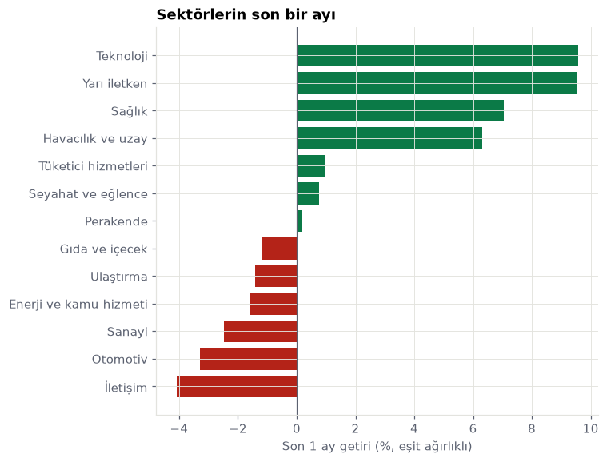
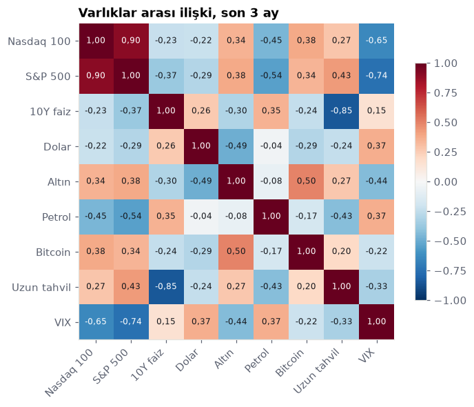
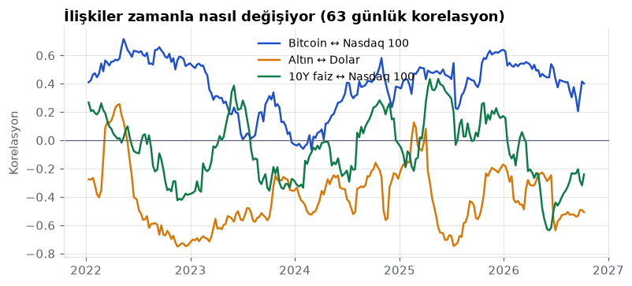
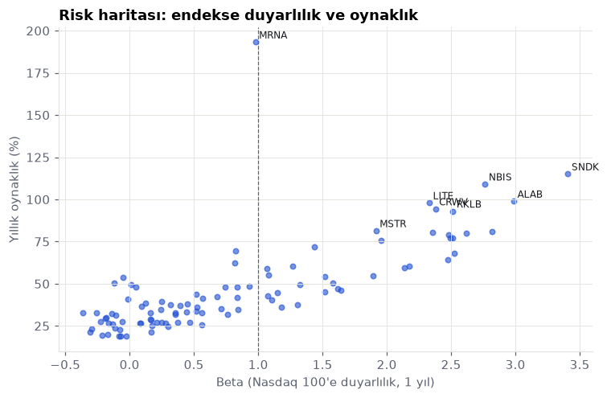
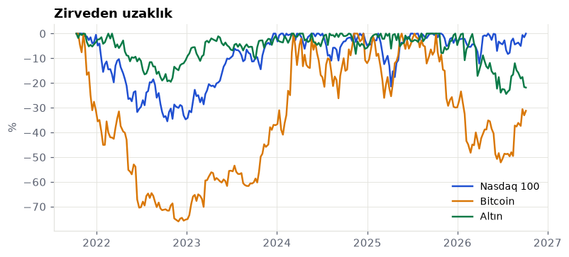
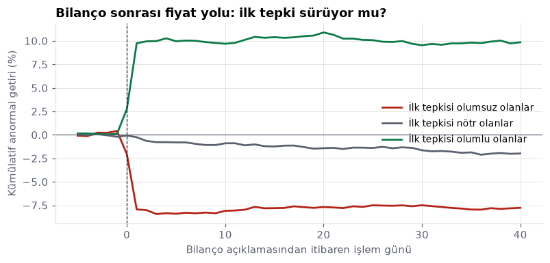

# Haftalık piyasa raporu · 2026-W41

_Otomatik üretildi: 2026-10-09 kapanış verisiyle. Kaynak kod: [`analytics/`](../../analytics). Yatırım tavsiyesi değildir._

## Özet
- Nasdaq 100 yükseliş trendinde (200 günlük ortalamanın üstünde) ve oynaklık uzun dönem normaline göre normal. Bu, sakin bir yükseliş ortamı: geri çekilmeler genellikle sınırlı kalır.
- Son bir ayda en güçlü sektör Teknoloji, en zayıfı İletişim. Para büyüme ve döngüsel tarafa kayıyor.
- 10Y faiz ↔ Nasdaq 100 ilişkisi bir yıl öncesine göre belirgin zayıfladı. İki varlık birbirinden ayrışıyor; biri diğerinin hareketini eskisi kadar açıklamıyor.
- Uzun tahvil ↔ Nasdaq 100 ilişkisi bir yıl öncesine göre belirgin güçlendi. İki varlık artık daha çok birlikte hareket ediyor; birini diğerine karşı çeşitlendirme aracı olarak kullanmak eskisi kadar işe yaramaz.
- Bilanço açıklamalarından sonraki iki günde hisseler, sıradan iki günlük dönemlere göre yaklaşık 2,8 kat fazla oynuyor (894 bilanço). İlk tepkinin yönü sonraki iki ayı açıklamıyor (p=0,96): büyük şirketlerde bilanço haberi hızla fiyatlanıyor, sürüklenme görülmüyor.
- Yöneticilerin piyasadan alım yaptığı 24 olayda hisse sonraki iki ayda piyasaya göre ortalama 16,2 puan fazla getiri sağladı; bu fark anlamlı.
- Son iki haftada getirisi ya da hacmi kendi normalinin çok dışına çıkan varlıklar: CEG, DASH, MELI, PEP, SBUX, SNPS. Bu günlerin arkasında genellikle bilanço, haber ya da endeks değişikliği olur.

## Sektörler

| Sektör | 1 hafta % | 1 ay % | 3 ay % | Öncü | Geride kalan |
|---|---|---|---|---|---|
| Teknoloji | 1,7 | 9,6 | 13,9 | SHOP | WDC |
| Yarı iletken | −5,2 | 9,5 | 1,0 | MRVL | AVGO |
| Sağlık | 4,4 | 7,0 | 24,4 | MRNA | PAYX |
| Havacılık ve uzay | −1,6 | 6,3 | −6,6 | RKLB | HONA |
| Tüketici hizmetleri | 4,5 | 1,0 | 10,2 | PYPL | DASH |
| Seyahat ve eğlence | 1,6 | 0,8 | 1,9 | MAR | BKNG |
| Perakende | 2,9 | 0,2 | −0,3 | WMT | CPRT |
| Gıda ve içecek | 2,6 | −1,2 | −3,1 | KDP | PEP |
| Ulaştırma | 0,2 | −1,4 | −13,1 | ODFL | CSX |
| Enerji ve kamu hizmeti | 5,7 | −1,6 | −2,0 | CEG | FANG |
| Sanayi | 1,6 | −2,5 | −4,4 | TRI | AXON |
| Otomotiv | 0,9 | −3,3 | −7,9 | TSLA | PCAR |
| İletişim | −0,1 | −4,1 | −6,9 | META | CMCSA |

## Haftanın en çok yükselen ve düşen hisseleri
| Kod | Şirket | 1 hafta % | 1 ay % |
|---|---|---|---|
| MRNA | Moderna | 18,4 | 64,7 |
| CEG | Constellation Energy | 15,8 | 4,2 |
| SHOP | Shopify | 12,9 | 35,0 |
| MELI | Mercadolibre | 11,4 | −0,9 |
| ADSK | Autodesk | 11,0 | 11,2 |
| ARM | ARM | −13,4 | 4,8 |
| INTC | Intel | −12,3 | 4,4 |
| TER | Teradyne | −10,3 | 8,8 |
| TMUS | T-Mobile US | −9,2 | −16,1 |
| NBIS | Nebius | −9,0 | −3,1 |

## Varlıklar arası ilişki

## Risk

## Olağandışı günler (son 10 işlem günü)
Getirisi ya da hacmi, önceki 63 günün ortalamasından en az 3 standart sapma uzak olanlar.

| Tarih | Kod | Getiri | Getiri z | Hacim z |
|---|---|---|---|---|
| 2026-09-28 | DASH | −7,7 | −3,3 | 1,9 |
| 2026-10-01 | SNPS | 12,8 | 4,2 | 3,6 |
| 2026-10-02 | STX | −10,2 | −2,3 | 3,6 |
| 2026-10-02 | WDC | −10,2 | −2,0 | 4,3 |
| 2026-10-05 | MELI | 9,7 | 4,6 | 2,6 |
| 2026-10-06 | CEG | 12,2 | 5,2 | 5,9 |
| 2026-10-08 | PEP | 3,7 | 3,4 | 4,2 |
| 2026-10-08 | SBUX | −0,4 | −0,2 | 5,0 |
| 2026-10-09 | TMUS | −13,3 | −5,5 | 4,7 |

## Araştırma: Bilanço sonrası fiyat davranışı

894 bilanço açıklaması (91 şirket, 2023-05-04 – 2026-08-13). Anormal getiri piyasa modeliyle hesaplandı (her olay için önceki 220 günde hissenin Nasdaq 100'e duyarlılığı).

| İlk tepki grubu | Olay | Sonraki 2 ay ort. anormal getiri % | t | p |
|---|---|---|---|---|
| olumsuz | 298 | 0,17 | 0,16 | 0,876 |
| nötr | 298 | −1,73 | −2,53 | 0,012 |
| olumlu | 298 | 0,10 | 0,11 | 0,914 |

Olumlu ve olumsuz grup farkı: −0,07 puan (Welch t-testi p=0,961). Tepki ile sonraki getiri arasındaki sıra korelasyonu: 0,017 (p=0,615).

## Veri kalitesi
- 107 varlıkta 200 günden uzun temiz fiyat geçmişi var.
- Temizleme sırasında 1 tek günlük hatalı fiyat düzeltildi.
